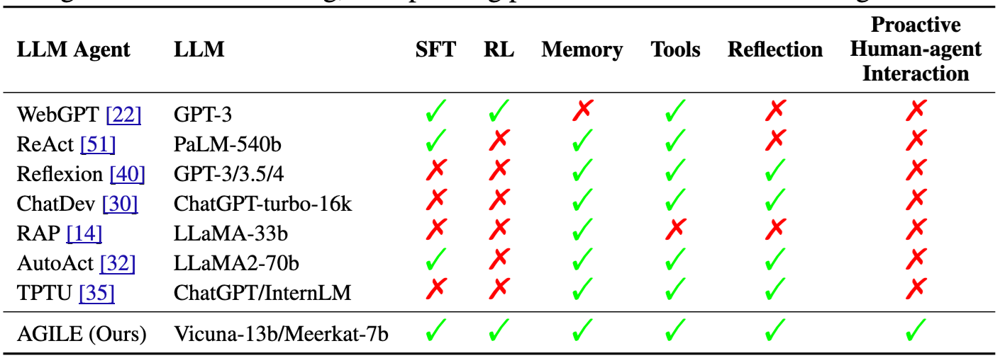

# Awesome-Agent-Training

We are witnessing an exciting era where LLM capabilities have rapidly advanced in just a few years, enabling lower costs and stronger performance for real-world applications.

The next key step is to enhance Language Agents' ability to handle diverse tasks, which is crucial for deployment. We also focus on optimizing their structure and training methods to improve task completion rates.

Training Language Agents is an essential yet still emerging technology. This repository is dedicated to pushing the boundaries and exploring new possibilities in this field.

[The Second Half](https://ysymyth.github.io/The-Second-Half/)

<!-- * []  () 
* []  () () -->

## Papers

### Learning from Good Behavior (behavior clone)
* [2503] [ATLaS: Agent Tuning via Learning Critical Steps](https://arxiv.org/pdf/2503.02197) (UTS, UMD) (Not learning all behaviors, but some of the key behaviors.)
* [2502] [STeCa: Step-level Trajectory Calibration for LLM Agent Learning](https://arxiv.org/pdf/2502.14276) (PolyU) [The behaviors to be learned may not be exactly gold standard, so calibrate them.]
* [2502] [Training a Generally Curious Agent](https://arxiv.org/pdf/2502.17543) (CMU) [we use rejection sampling on self-generated data to teach the model better behaviors. look like combine ArCHer with PAE, multi-turn decision making and self-generated data. [some explanations](https://www.themoonlight.io/zh/review/training-a-generally-curious-agent)]
* [2501] [Improving Vision-Language-Action Model with Online Reinforcement Learning](https://arxiv.org/pdf/2501.16664) (THU) [Generating successful trajectories with RL, then use SL to learn new data. Two-steps iRe-VLA]
* [2412] [Proposer-Agent-Evaluator(PAE): Autonomous Skill Discovery For Foundation Model Internet Agents](https://arxiv.org/pdf/2412.13194) (ICLR 25-r | UC Berkeley) [Good behavior is limited, synthesize more good behavior.]
* [2406] [Watch Every Step! LLM Agent Learning via Iterative Step-Level Process Refinement](https://arxiv.org/pdf/2406.11176) (EMNLP 24 | PKU) [Learning good behavior is not as well rewarded with outcome level as Step-Level.]
* [2310] [AgentTuning: Enabling Generalized Agent Abilities for LLMs](https://arxiv.org/abs/2310.12823) (ICLR 24-r | Tsinghua, 144) [Similar to FireAct]
* [2310] ⭐️ [FireAct: Toward Language Agent Fine-tuning](https://arxiv.org/abs/2310.05915) (ICLR 23 | Princeton, 107) [fine-tuning Llama2-7B with 500 agent trajectories generated by GPT-4 leads to a 77% HotpotQA performance increase.]
* Comment: I think iRe-VLA and PAE are similar.

### Utilizing Mistakes (selective/comparative behavior clone) 
* [2501] ⭐️ [Agent-R: Training Language Model Agents to Reflect via Iterative Self-Training](https://arxiv.org/pdf/2501.11425) (ByteDance) [behavior cloning is not robust for the real world. learning from mistake (self-critique) is important, using MCTS create datasets. self-reflaction]
* [2408] [Agent Q: Advanced Reasoning and Learning for Autonomous AI Agents](https://arxiv.org/pdf/2408.07199) (ICLR 25-R | MultiOn, Stanford) （a combination of DPO, MCTS, and process supervision for web navigation task）
* [2403] [Trial and Error: Exploration-Based Trajectory Optimization for LLM Agents](https://arxiv.org/pdf/2403.02502)  (ACL 24 | PKU) [allows agents to learn from their exploration failures. Gathering failure
trajectories to create contrastive trajectory pairs. DPO]
* Comment: Learning from ideally good existing behaviors, points of challenge, behaviors not always right, picked out or DPO utilized.

### Multi-turn RL for Agent
* [0425] ⭐️ [RAGEN: Understanding Self-Evolution in LLM A gents via
Multi-Turn Reinforcement Learning](https://github.com/RAGEN-AI/RAGEN/blob/main/RAGEN.pdf) (NWU) [The success behind o4 maybe multi-turn RL]
* [2504] [Beyond Single-Turn: A Survey on Multi-Turn Interactions with Large Language Models](https://arxiv.org/pdf/2504.04717) [supplementary material]
* [2503] ⭐️ [SWEET-RL: Training Multi-Turn LLM Agents on Collaborative Reasoning Tasks](https://arxiv.org/pdf/2503.15478) (Meta, UC Berkeley) [we want the agents not only complete a task, but also complete the task in the way we want it to be done. propose new ColBench.]
* [2502] [Multi-Turn Code Generation Through Single-Step Rewards](https://arxiv.org/pdf/2502.20380) [supplementary material]
* [2502] [EPO: Explicit Policy Optimization for Strategic Reasoning in LLMs via Reinforcement Learning](https://arxiv.org/pdf/2502.12486) (UCAS) [ArCHer plus]
* [2402] [ArCHer: Training Language Model Agents via Hierarchical Multi-Turn RL](https://arxiv.org/pdf/2402.19446) (ICML 24 | UC Berkeley) [Optimize the end goal with multi-turn RL, not for the short-term goal. frames multi-step tasks via a two-level hierarchical MDP, where the higher level MDP considers completions as actions and the lower level MDP considers tokens as actions by ucode]

### Alignment with the Real World
* [2504] ⭐️ [LLMs are Greedy Agents: Effects of RL Fine-tuning on Decision-Making Abilities](https://arxiv.org/pdf/2504.16078) (DeepMind) [failure modes in decision-making: greediness, frequency bias, and the knowing-doing gap. Mitigation of these shortcomings by fine-tuning via Reinforcement Learning (RL) on self-generated CoT rationales.]
* [2503] [UI-R1: Enhancing Action Prediction of GUI Agents by Reinforcement Learning](https://arxiv.org/pdf/2503.21620) (VIVO Lab, CUHK) [Explore GUI Agent with GRPO, inspired by Deepseek-r1]
* [2502] [Digi-Q: Learning Q-Value Functions for Training Device-Control Agents](https://arxiv.org/pdf/2502.15760) (ICLR 25 | UC Berkeley) [DigiRL plus, Add VLM Q function]
* [2411] [WebRL: Training LLM Web Agents via Self-Evolving Online Curriculum Reinforcement Learning](https://arxiv.org/pdf/2411.02337) (ICLR 25 | Tsinghua) (DigiRL plus)
* [2406] ⭐️ [DigiRL: Training In-The-Wild Device-Control Agents with Autonomous Reinforcement Learning](https://arxiv.org/pdf/2406.11896) (NeurIPS 24 | UC Berkeley) [Step 1: learning in clean environment, step2: learning in real world because the real world includes many unexpected situtation]
* [2401] ⭐️ [Grounding large language models in interactive environments with online reinforcement learning](https://proceedings.mlr.press/v202/carta23a/carta23a.pdf) (ICML 23 | Huggingface, 196)
* [2401] ⭐️ [True Knowledge Comes from Practice: Aligning LLMs with Embodied Environments via Reinforcement Learning](https://arxiv.org/abs/2401.14151) (ICLR 24 | NTU, 47)
* Comment: WebRL and DigiRL can be unstable and highly sensitive to hyperparameters and reward design commented by PLAN-AND-ACT

### Agent Framework Design
* [2405] [AGILE: A Novel Reinforcement Learning Framework of LLM Agents](https://arxiv.org/pdf/2405.14751v2) (NeurIPS 24 | ByteDance) [The same type of work as ReAct, WebGPT, presents a dataset.]
* [2303] [Reflexion: Language Agents with Verbal Reinforcement Learning](https://arxiv.org/pdf/2303.11366) (NeurIPS 23 | Shunyu Yao, 1420)
* [2210] [ReAct: Synergizing Reasoning and Acting in Language Models](https://arxiv.org/pdf/2210.03629) (ICLR 23 | Shunyu Yao, 2731) [[code](https://github.com/ysymyth/ReAct)]
* [2112] [WebGPT: Browser-assisted question-answering with human feedback](https://arxiv.org/pdf/2112.09332) (OpenAI, 1275)

### Long-Horizon Task
* [2503] [PLAN-AND-ACT: Improving Planning of Agents for Long-Horizon Tasks](https://arxiv.org/pdf/2503.09572) (UC Berkeley) [Recent work separates high-level planning from low-level execution, enabling better balance between objectives and details. However, generating accurate plans remains difficult since LLMs are not inherently trained for this task. This paper generate good plans.]
* [2503] [MPO: Boosting LLM Agents with Meta Plan Optimization](https://arxiv.org/pdf/2503.02682) (PKU) [Imroving planning]
* [2502] [Reinforcement Learning for Long-Horizon Interactive LLM Agents](https://arxiv.org/pdf/2502.01600) (Apple) [propose AppWorld task other than WebShop]
* Comment: Generating data seems to be used as a strategy.

### Supplementary Papers
* [2305] [Direct Preference Optimization: Your Language Model is Secretly a Reward Model](https://arxiv.org/pdf/2305.18290)
* [2203] [Training language models to follow instructions with human feedback](https://arxiv.org/pdf/2203.02155)
* [2009] [Learning to summarize from human feedback](https://proceedings.neurips.cc/paper_files/paper/2020/file/1f89885d556929e98d3ef9b86448f951-Paper.pdf)
* [1706] [Deep Reinforcement Learning from Human Preferences](https://proceedings.neurips.cc/paper_files/paper/2017/file/d5e2c0adad503c91f91df240d0cd4e49-Paper.pdf)

### To be Classified

----------------

#### Tool Call 
* [2504] ⭐️ [τ -bench: A Benchmark for Tool-Agent-User Interaction in Real-World Domains](https://arxiv.org/pdf/2406.12045) (ICLR 25 | Shunyu Yao) 
* [2504] [Synthetic Data Generation & Multi-Step RL for Reasoning & Tool Use](https://arxiv.org/pdf/2504.04736) (Stanford)
* [2504] [OTC: Optimal Tool Calls via Reinforcement Learning](https://arxiv.org/pdf/2504.14870) (CUHK)

#### RL + Search
* [2503] [R1-Searcher: Incentivizing the Search Capability in LLMs via Reinforcement Learning](https://arxiv.org/pdf/2503.05592) (RUC) 
* [2503] [Search-R1: Training LLMs to Reason and Leverage Search Engines with Reinforcement Learning](https://arxiv.org/pdf/2503.09516?) (UIUC) 
* [2503] [ReSearch: Learning to Reason with Search for LLMs via Reinforcement Learning](https://arxiv.org/pdf/2503.19470) (Baichuan) 

#### Meta-Thinking
* [2504] [Meta-Thinking in LLMs via Multi-Agent Reinforcement Learning: A Survey](https://arxiv.org/pdf/2504.14520) [Meta Thinking]

## Open-Source Project
*  [RAGEN](https://github.com/RAGEN-AI/RAGEN) (Training agent)
*  [Search-R1](https://github.com/PeterGriffinJin/Search-R1) (Train your LLMs to reason and call a search engine with reinforcement learning)
*  [OpenManus-RL](https://github.com/OpenManus/OpenManus-RL) (A live stream development of RL tunning for LLM agents)
*  [MetaSpatial](https://github.com/PzySeere/MetaSpatial) (Reinforcing 3D Spatial Reasoning in VLMs for the Metaverse)

## Contributing

* Feel free to contribute more papers or other any resources!
